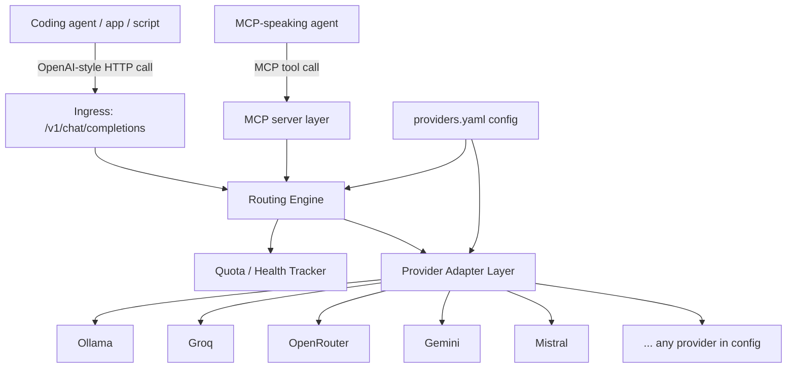
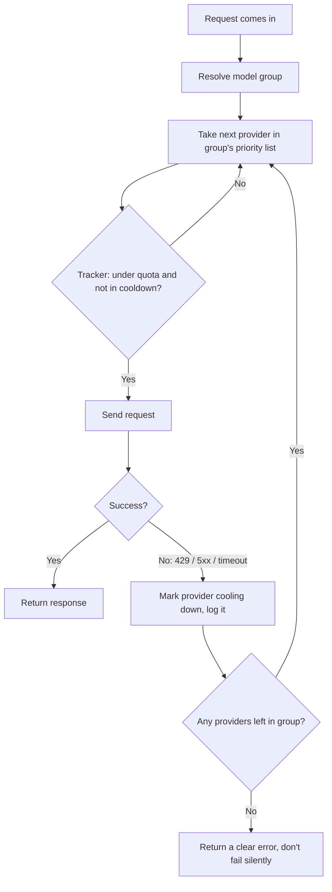

# AI Provider Router — Full Plan

One box that sits between your tools (coding agents, apps, scripts) and a bunch of AI providers. It picks a provider, and if that one is slow, down, or out of free quota, it quietly switches to the next one. Everything that talks to it just sees one normal AI API.

No code in this doc, just the plan.

---

## 1. What already exists (don't build blind)

A few things already do pieces of this. Worth knowing before building:

- **LiteLLM** — open source, Python. You write a config file listing models and fallback chains, it handles retries and switching. Closest thing to what you're describing. Could be forked/extended instead of built from zero.
- **OpenRouter** — a hosted version of the same idea, but it's a black box you don't control, and it can't route to your local Ollama or to providers it hasn't added.
- **Portkey** — hosted, adds logging/dashboards on top of fallback routing. Not free.
- **llmbuffet** (a small PyPI package) — pools about 15 free-tier providers behind one OpenAI-style endpoint with automatic failover and quota tracking. Almost exactly your idea, already exists in miniature.

None of these do the MCP side the way you want, and none let you freely mix free tiers the way you're describing. So there's real reason to build your own, just go in knowing the wheel is half-invented already. Decision point: build the router core yourself (more work, more control, better for a portfolio/learning angle) or fork LiteLLM's router logic and just add your own provider list + MCP layer on top (much faster).

---

## 2. Providers: yours plus 6 more

Free tiers change often, so treat every number below as "check before wiring it in," not gospel.

| Provider | Type | Free tier (roughly) | Good models | Notes |
|---|---|---|---|---|
| **Ollama** | Local | Unlimited, your hardware | Whatever you pull | No network dependency, but needs your GPU/CPU and is the slowest option under load |
| **OpenRouter** | Aggregator | ~20 RPM / 200 RPD shared across `:free` models | DeepSeek R1, Llama 3.3 70B, Qwen3 Coder 480B, GPT-OSS-120B | Great as a fallback layer by itself since it already spans many backends |
| **NVIDIA NIM** | First-party infra | Free API access | Accelerated Llama, Mistral, Gemma builds | Good raw speed, smaller free catalog than others |
| **Groq** | Inference hardware | No card needed, ~30 RPM / 14,400 RPD | Llama 3.3 70B, Llama 4 Scout/Maverick, Kimi K2, Qwen QwQ 32B | Fastest free inference around (LPU hardware), your strongest default pick |
| **Alibaba (Qwen/DashScope)** | First-party | **Changed in 2026**: the old free OAuth tier was shut down April 15, 2026. Now it's 1M trial tokens per model, 90 days, Singapore endpoint only | Qwen3 family, Qwen3 Coder | Don't rely on Alibaba as a *permanent* free node. Get Qwen models for free instead through OpenRouter's free tier or through Groq (both host Qwen3/QwQ open weights) |
| **Google AI Studio (Gemini)** | First-party | Generous by first-party standards; Flash tier especially | Gemini 2.5 Flash, 2.5 Pro | Strong reasoning for free, but Google has trimmed these limits before without much warning |
| **Mistral (La Plateforme)** | First-party | Reported up to ~1B tokens/month free, no card | Mistral Large, **Codestral** | Codestral specifically is aimed at coding agents, this one matters for your "coding agent" use case |
| **Cloudflare Workers AI** | Edge infra | ~10,000 "neurons"/day, resets daily | Qwen3 (reasoning + vision, big context) | Good backup layer, ties in nicely if you ever want edge deployment |
| **SambaNova Cloud** | Inference hardware | Free tier, low RPM per model (1–30 depending on model) | Llama 3.1/3.2 family, Qwen2.5 72B, Qwen2.5 Coder 32B | Low throughput but decent model range, fine as a deep fallback |
| **GitHub Models** | First-party (Microsoft) | Free via GitHub account, limits scale with your GitHub/Copilot tier | Wide catalog incl. AI21 Jamba, Cohere Command R/R+ | Easy to add since you probably already have a GitHub account |
| **Hugging Face Inference API** | Aggregator | Free tier, rate-limited | Thousands of community models | Breadth over reliability, good as a last-resort layer |

That's your 5 plus 6 more, 11 total, plenty to pick from. Start with a smaller subset (see Phase 0 below) and grow the list over time — the whole point of the config-driven design is that growing the list costs you a text edit, not a rebuild.

---

## 3. Architecture



Six pieces:

1. **Ingress layer** — one normal OpenAI-shaped HTTP endpoint (`/v1/chat/completions`, `/v1/models`). This is the trick behind "connect to any program": almost every coding agent, SDK, and app already knows how to talk to an OpenAI-shaped API. Point it at your router's URL with any placeholder key, and it just works. No per-tool integration needed.

2. **MCP layer** — a thin MCP server sitting next to the same core, exposing tools like `ask_model`, `list_providers`, `provider_status`, `force_provider`. This is for agents that talk MCP instead of raw HTTP. Same brain, two doors in.

3. **Routing engine** — the actual decision maker. Given a request: figure out which "model group" it belongs to (see section 4), check which providers in that group are currently healthy, pick the first one in priority order (or by cost/latency if you configure that later).

4. **Provider adapter layer** — one small adapter per provider. Handles auth, reshapes the request if that provider isn't already OpenAI-compatible (most are), normalizes the response, and reports back rate-limit info or errors.

5. **Config store** — a single `providers.yaml` (or JSON) file: base URL, auth, model list, known rate limits, priority, which group(s) each provider belongs to. Adding a provider means adding a block here, not writing code, as long as it's OpenAI-compatible. This is what makes it "add a provider as you please."

6. **Quota / health tracker** — small local state (SQLite works fine, even a JSON file would do for a first version) tracking requests used per minute/hour/day per provider and key, last error seen, current cooldown. Updated after every call, success or failure. This is what turns "ran out on one" into something the router actually detects instead of just reacting to.

---

## 4. Model groups (don't fail over randomly)

The one thing that separates a good router from a dumb retry loop: don't fail over to *any* model, fail over *within an equivalence class*, so quality doesn't randomly drop mid-task. You define these groups yourself in config, the router just walks them in order.

Example groups:

- **fast-general**: Groq Llama 3.3 70B → Cerebras/OpenRouter Llama 3.3 70B → Ollama local Llama
- **reasoning**: Gemini 2.5 Pro → OpenRouter free DeepSeek R1 → Qwen QwQ 32B (Groq)
- **coding**: Mistral Codestral → OpenRouter free Qwen3 Coder 480B → local Ollama qwen2.5-coder

A coding agent asks for "coding," the router only ever swaps it between things that are actually good at coding.

---

## 5. Failover flow



Two details worth locking in early:
- **Cooldown, not permanent ban.** A provider that 429s gets parked for N seconds/minutes, not removed forever. Free quotas reset.
- **Sanity-check the response, not just the status code.** Some providers return a 200 with garbage or empty content instead of a real error. Cheap check (non-empty, roughly sane length) before you trust a fallback actually worked.

---

## 6. Adding a new provider (the actual requirement)

- **OpenAI-compatible provider (most of them):** add one YAML block — base URL, API key env var name, model list, known rate limits, which group(s) it joins. Zero new code.
- **Non-standard provider (rare):** a small adapter implementing three functions — format the request, parse the response, parse the error. Everything else in the system stays untouched.
- **Nice-to-have later:** since you're already building terminal infra in DeskFlow, a `router add-provider` interactive command there instead of hand-editing YAML.

Example of what a config entry looks like conceptually (not real code, just the shape):

```yaml
providers:
  - name: groq
    base_url: https://api.groq.com/openai/v1
    api_key_env: GROQ_API_KEY
    openai_compatible: true
    models: [llama-3.3-70b, qwen-qwq-32b]
    limits: { rpm: 30, rpd: 14400 }
    groups: [fast-general, reasoning]
    priority: 1
```

---

## 7. Tech stack suggestion

The strongest ecosystem for this (LiteLLM, most provider SDKs, async HTTP handling) is Python. You already use Python for ML work, so: build the core in Python, FastAPI + httpx, async. Runs as a local service on something like `localhost:4000`. The MCP layer is a thin wrapper on the official MCP Python SDK sitting on the exact same routing core, not a separate system.

If you eventually want it living inside DeskFlow, the router can run as a small Python sidecar process that DeskFlow's terminal/backend talks to over localhost, the same pattern DeskFlow's own MCP server layer already seems to follow.

---

## 8. Build phases

Planning order, not a build-it-now list:

1. **Phase 0** — pick a small starting set (say Groq, OpenRouter, Gemini, Ollama), define the `providers.yaml` shape.
2. **Phase 1** — core router: ingress endpoint, adapters for that starting set, naive failover (catch an error, try the next one, no tracker yet).
3. **Phase 2** — real quota tracker: parse rate-limit headers, store usage, add cooldowns. This is the step where "auto-switch when it runs out" stops being reactive and becomes actually predictive.
4. **Phase 3** — MCP layer on top of the same core.
5. **Phase 4** — add the rest of the providers (Nvidia, Alibaba via the OpenRouter/Groq workaround, Mistral, Cloudflare, SambaNova, GitHub Models, Hugging Face) as pure config entries.
6. **Phase 5** — polish: add-provider ergonomics (CLI/UI), latency- or cost-based routing instead of plain priority order, a simple log of what was used and why.

---

## 9. Things to watch out for

- Free tier terms shift often, and some providers frown on obvious automated failover hammering their free tier. Keep total request rate reasonable, skim each provider's terms on automation before going hard.
- Rate limit windows differ (per minute vs. per hour vs. per day, sometimes per model), so the tracker needs more than one counter per provider.
- Regional split (Alibaba, some Cloudflare products) may need an explicit base URL per region.
- Keys go in environment variables or a secrets file, never inside `providers.yaml` itself.
- A provider showing "up" and a provider giving you a *good* answer are two different checks, don't conflate them.
